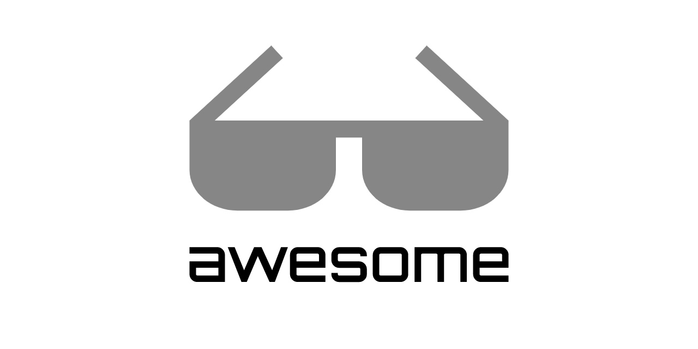

# Awesome Flextype
A collection of awesome Flextype plugins, articles, resources and shiny things.

[Flextype](https://flextype.org) is an open-source Hybrid Content Management System with the freedom of a headless CMS and with the full functionality of a traditional CMS.

## Contents

- [Official Links](#official-links)
- [Community](#community)
- [Publications](#publications)
- [Extend](#extend)

### Official Links
- **Website** - [flextype.org](https://flextype.org)
- **Documentation** - [flextype.org/documentation](https://flextype.org/documentation)
- **Sponsors** - [flextype.org/sponsors](https://flextype.org/sponsors)
- **Repository** - [github.com/flextype/flextype](https://github.com/flextype/flextype)
- **International Translator Team** - [flextype.org/international-translator-team](https://flextype.org/en/international-translator-team)

### Community
- [Discord](https://flextype.org/en/discord) - Got a question about setting up or using Flextype? We'll do our best to help you out. Also here you may start discussions about core, plugin and themes development.
- [Twitter](https://twitter.com/getflextype) - Follow Flextype on Twitter to get real-time news regarding the development and all events we are attending.
- [Vkontakte](https://vk.com/flextype) - Russian Flextype Community!

### Publications
#### 2020
- [Top 10 des CMS gratuits pour 2020](https://www.blogduwebdesign.com/meilleurs-cms/) by Fabien Berthoux (Blog Du Webdesig)
- [8 Best CMS for 2020](https://www.webdesignerdepot.com/2020/05/8-best-cms-for-2020/) by Natasha Colyer (Web Designer Depot)
#### 2019
- [12 Best CMS for 2019](https://www.webdesignerdepot.com/2019/08/12-best-cms-for-2019/) by Ezequiel Bruni (Web Designer Depot)
- [WordPress alternatives: 12 best flat file CMS](https://blog.ssdnodes.com/blog/flat-file-wordpress-alternatives/) by Joel Hans (Serverwise)
- [Flextype - A New Flat File CMS has been Released](https://www.cmscritic.com/flextype-a-new-flat-file-cms-has-been-released/) by Mike Johnston (CMS Criric)
- [Flextype Review](https://www.cmscritic.com/flextype-review/) by Mike Johnston (CMS Criric)
#### Other
- [Flextype in the list of Content Management Systems for Jamstack Sites](https://headlesscms.org/projects/flextype/)
- [Flextype in the gallery of awesome websites built with Tailwind CSS framework.](https://builtwithtailwind.com/site/flextype)
- [Flextype – headless content management system with the full functionality of a traditional CMS](https://www.linuxlinks.com/flextype-headless-content-management-system/) by LinuxLinks

### Extend
- [Plugins](https://flextype.org/en/downloads/extend/plugins)
- [Themes](https://flextype.org/en/downloads/extend/themes)
